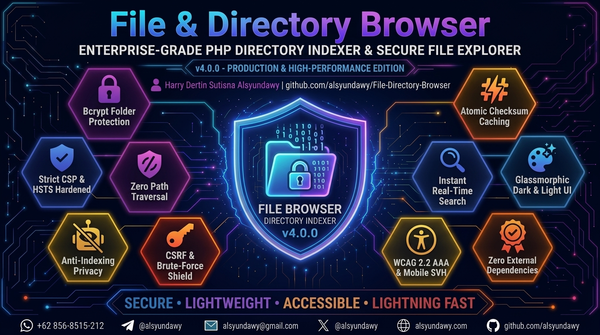

<!-- markdownlint-disable-file MD033 MD041 -->

<p align="center">
  <a href="https://github.com/alsyundawy/File-Directory-Browser">
    
  </a>
</p>

<h1 align="center">📁 File & Directory Browser</h1>

<h3 align="center">Enterprise-Grade Single-File PHP Directory Indexer & Secure File Explorer</h3>

<p align="center">
  <a href="https://github.com/alsyundawy/File-Directory-Browser/releases/tag/v4.0.0"></a>
  <a href="https://www.php.net/"></a>
  <a href="LICENSE"></a>
  <a href="https://phpstan.org/"></a>
  <a href="https://www.w3.org/WAI/standards-guidelines/wcag/"></a>
  <a href="#security-architecture"></a>
  <a href="https://github.com/squizlabs/PHP_CodeSniffer"></a>
</p>

<p align="center">
  A secure, lightweight, and modern single-file PHP directory indexer with glassmorphic UI, real-time search, atomic hash caching, bcrypt folder protection, strict Content Security Policy, and zero external dependencies.
</p>

<p align="center">
  <a href="https://github.com/alsyundawy/File-Directory-Browser/releases/tag/v4.0.0">
    
  </a>
  <a href="https://github.com/alsyundawy/File-Directory-Browser/releases">
    
  </a>
</p>

> Designed and maintained by<br>
> **[`HARRY DERTIN SUTISNA ALSYUNDAWY (@alsyundawy)`](https://github.com/alsyundawy)** —<br>
> Modern drop-in replacement for Apache `mod_autoindex` and Nginx `autoindex` with zero database or package dependencies.
>
> 📦 **[`GitHub Releases (v4.0.0)`](https://github.com/alsyundawy/File-Directory-Browser/releases/tag/v4.0.0)** &nbsp;|&nbsp;
> ⚡ **[`Quick Start`](#quick-start)** &nbsp;|&nbsp;
> 🔒 **[`Security Architecture`](#security-architecture)** &nbsp;|&nbsp;
> 📜 **[`Full Changelog`](#changelog)** &nbsp;|&nbsp;
> 💖 **[`Support via PayPal`](https://www.paypal.me/alsyundawy)** &nbsp;|&nbsp;
> 🇮🇩 **[`QRIS Donation`](#support--donation)**

---

## 🧭 Navigation

- [About The Project](#about-the-project)
- [User Interface](#user-interface)
- [Key Features](#key-features)
- [System Requirements](#system-requirements)
- [Quick Start](#quick-start)
- [Production Installation Guide (Ubuntu / Debian)](#production-installation-guide-ubuntu--debian)
  - [Step 1: System Preparation & Deployment](#step-1-system-preparation--file-deployment)
  - [Step 2 (Option A): Apache Web Server Setup](#step-2-option-a-apache-web-server-setup)
  - [Step 2 (Option B): Nginx + PHP-FPM Setup](#step-2-option-b-nginx--php-fpm-setup)
  - [Step 3: SSL / HTTPS Encryption with Let's Encrypt](#step-3-ssl--https-encryption-with-lets-encrypt-recommended)
- [Configuration Reference](#configuration-reference)
  - [General Settings](#general-settings)
  - [Folder Password Protection](#folder-password-protection)
- [Keyboard Shortcuts](#keyboard-shortcuts)
- [Security Architecture](#security-architecture)
- [Quality Assurance & Static Analysis](#quality-assurance--static-analysis)
- [Changelog](#changelog)
- [Documentation Notes](#documentation-notes)
- [Project Directory Structure](#project-directory-structure)
- [Contributing](#contributing)
- [Maintainer & Contact](#maintainer--contact)
- [Support & Donation](#support--donation)
- [License](#license)

---

## About The Project

**File & Directory Browser** is a security-hardened, high-performance, single-file PHP directory indexer and file explorer. Designed as a modern, elegant replacement for standard web server auto-indexing modules (such as Apache `mod_autoindex` or Nginx `autoindex`), it delivers a responsive web experience without requiring database servers, heavy backend frameworks, or NPM/Composer package dependencies.

Everything runs self-contained from a single `index.php` file, featuring instant client-side search filtering, deterministic multi-attribute sorting, on-demand checksum generation (CRC32, MD5, SHA-1) backed by an atomic local caching system, bcrypt folder protection, enterprise-grade defense-in-depth security headers (CSP nonce, HSTS, anti-indexing), and a Glassmorphic UI fully compliant with WCAG 2.2 AAA accessibility standards.

---

## User Interface

### Modern Glassmorphic Dark UI


### Classic Ambient Dark UI


---

## Key Features

- 🔒 **Enterprise-Grade Security & Defense-in-Depth:**
  - **HTTP Strict Transport Security (HSTS):** Emits `Strict-Transport-Security: max-age=31536000; includeSubDomains; preload` on HTTPS connections to mandate end-to-end encrypted transport.
  - **Dynamic Content Security Policy (CSP):** Every request generates a cryptographically secure nonce (`bin2hex(random_bytes(16))`) enforcing strict `script-src` and `style-src` policies without `'unsafe-inline'`.
  - **Path Traversal & Directory Escape Defense:** Strict path segment sanitization and canonical filesystem path verification (`realpath`) preventing traversal attacks.
  - **Symlink Escape Containment:** External symlinks outside the base directory are strictly blocked by default; file entries are validated against containment boundaries before enumeration.
  - **Comprehensive Security Headers:** Includes `X-Content-Type-Options: nosniff`, `X-Frame-Options: DENY`, `Referrer-Policy: strict-origin-when-cross-origin`, `Permissions-Policy`, and `X-XSS-Protection: 0`.
  - **Search Engine Anti-Indexing Privacy:** Emits `X-Robots-Tag: noindex, nofollow, noarchive` headers and `<meta name="robots" content="noindex,nofollow">` tags across all pages to block crawler indexing.
  - **Hardened Session Security:** Session cookies configured with `HttpOnly`, `SameSite=Strict`, and `Secure` flags, complemented by session fixation defenses (`session_regenerate_id(true)`).
  - **Defense-in-Depth Cache Directory Protection:** Automatic `.cache/` folder hardening generating both `.htaccess` (Apache) and an empty `index.html` (Nginx, Caddy, Lighttpd) to deny unauthorized cache browsing.
  - **Bcrypt Password-Protected Folders:** Restrict access to designated folders using secure bcrypt hashes (`password_hash` / `password_verify`) with zero plaintext storage.
  - **CSRF Token Protection & Brute-Force Rate Limiting:** Password forms implement cryptographically secure `bin2hex(random_bytes(32))` CSRF tokens with post-login regeneration, plus configurable brute-force lockout rules (`$loginMaxAttempts` and `$loginLockSeconds`) with live countdown timers.
  - **Sensitive File Exclusion:** Critical system files (`.env`, `.php`, `.git`, `.htaccess`, `.sql`, etc.) are excluded from directory listings and checksum checks by default.

- ⚡ **Atomic Hash Caching & Deterministic Sorting:**
  - **On-Demand File Checksums:** Computes CRC32, MD5, and SHA-1 checksums on demand with interactive one-click clipboard copying.
  - **Atomic High-Performance Cache:** Checksum results are stored locally, keyed by file size, modification time (`mtime`), and schema version to eliminate redundant I/O operations. Cache writes use atomic temporary file creation and POSIX `rename(2)` syscalls.
  - **Deterministic Natural Sorting:** Implements natural sort tie-breaking (`strnatcasecmp`) in directory sorting to guarantee consistent row order when timestamps or file sizes are identical.
  - **Semantic Sort Controls:** Column headers utilize accessible `<button type="button" class="sort-btn">` controls with dynamic `aria-sort` indicators and nonced JavaScript navigation.

- 🔍 **Real-Time Search & Keyboard Navigation:**
  - **Instant Client-Side Filtering:** Zero-reload browser filtering by filename using client-side JavaScript that preserves table layout integrity.
  - **Keyboard Quick Navigation:** Press `/` or `Ctrl+K` (`Cmd+K` on macOS) to instantly focus the search bar; press `Escape` to clear search filters and dismiss.
  - **Interactive Breadcrumb Navigation:** Path breadcrumbs with dynamic folder icons (`fa-folder-open`), clean URL structure (`/?berkas=folder/subfolder`), and `aria-current="page"` semantics.
  - **Floating Home FAB & Back-to-Top:** Smooth floating action buttons for instant return to root and top-scrolling.

- 🎨 **Modern Glassmorphic UI & Full Accessibility (WCAG 2.2 AAA):**
  - **Glassmorphic Aesthetic:** Ambient backdrop filters, dark/light theme switching, and dynamically color-coded file icons based on extension types.
  - **Mobile Viewport & Safe-Area Polish:** Engineered with `viewport-fit=cover`, `min-height: 100svh` (with `100vh` fallback) to eliminate mobile URL bar jumping, and `env(safe-area-inset-bottom)` padding for bezel-less screens (iPhone, iPad, Android).
  - **WCAG 2.2 AAA Contrast:** High-contrast text styling achieving > 7.5:1 contrast ratios across dark and light palettes.
  - **Accessible Table & Semantic Landmarks:** Wrapped in `<section class="table-wrap" aria-label="File listing">` landmark, native `scope="col"` on headers, high-visibility `:focus-visible` keyboard rings, and semantic `<output class="empty-state">` live regions for screen readers.
  - **Reduced Motion Support:** Fully respects `@media (prefers-reduced-motion: reduce)` system accessibility preferences.

- 🛠️ **Code Quality & Static Analysis Compliance:**
  - **PHPStan Level Max (Level 9):** 0 errors and 0 warnings with strict typing and generic PHPDoc annotations.
  - **Psalm Level 3:** 0 errors and 0 warnings.
  - **100% PSR-12 Standard:** 0 errors on PHP CodeSniffer (`phpcs --standard=PSR12`).
  - **Clean Architecture:** Minimized cognitive complexity, isolated single-return functions, and zero nested ternary operators.

---

## System Requirements

| Requirement | Minimum Version | Recommended | Notes |
| :--- | :--- | :--- | :--- |
| **PHP** | `8.0` | `8.2` — `8.4+` | Full compatibility across PHP 8.0, 8.1, 8.2, 8.3, and 8.4+ |
| **PHP Extensions** | `session`, `hash`, `json`, `pcre`, `spl` | Standard | All are standard built-in PHP core extensions |
| **Web Server** | Any standard web server | Apache 2.4+ / Nginx 1.20+ | Works with Apache, Nginx, Caddy, Lighttpd, or PHP CLI built-in server |
| **HTTPS / SSL** | Strongly Recommended | Let's Encrypt / TLS 1.3 | Required for secure cookies, HSTS enforcement, and CSRF protection |
| **Database** | None | None | **Zero database required** — operates completely file-based |

---

## Quick Start

1. **Download:** Grab the latest `index.php` from the [Releases](https://github.com/alsyundawy/File-Directory-Browser/releases) page or clone the repository:

   ```bash
   git clone https://github.com/alsyundawy/File-Directory-Browser.git
   ```

2. **Deploy:** Copy `index.php` into the directory on your web server that you want to browse and share.
3. **Configure:** Open `index.php` in any text editor to customize optional settings (page title, password-protected folders, date format, etc.).
4. **Browse:** Open your web browser and navigate to your directory URL (e.g. `http://localhost/files/` or `https://yourdomain.com/`).

---

## Production Installation Guide (Ubuntu / Debian)

Below are production-ready installation guides for **Ubuntu** (20.04 / 22.04 / 24.04 LTS) and **Debian** (11 / 12) using either **Apache** or **Nginx + PHP-FPM**.

### Step 1: System Preparation & File Deployment

Update your system package repositories and deploy the project files to your target web directory:

```bash
# Update package repositories
sudo apt update && sudo apt upgrade -y

# Install Git and essential utilities
sudo apt install -y git unzip curl

# Create target web root directory
sudo mkdir -p /var/www/file-browser

# Clone repository into web directory
sudo git clone https://github.com/alsyundawy/File-Directory-Browser.git /var/www/file-browser

# Set ownership to the web server user (www-data)
sudo chown -R www-data:www-data /var/www/file-browser
sudo chmod -R 755 /var/www/file-browser

# Grant write permissions for the .cache directory (required for hash caching)
sudo chmod -R 775 /var/www/file-browser
```

---

### Step 2 (Option A): Apache Web Server Setup

If you are using the Apache HTTP Server:

#### 1. Install Apache & PHP Modules

```bash
# Install Apache and PHP runtime with required extensions
sudo apt install -y apache2 php php-cli libapache2-mod-php php-json php-mbstring

# Enable required Apache modules (rewrite & headers)
sudo a2enmod rewrite headers
```

#### 2. Configure Apache Virtual Host

Create a new Virtual Host configuration:

```bash
sudo nano /etc/apache2/sites-available/file-browser.conf
```

Add the following configuration (replace `files.example.com` with your domain or server IP):

```apache
<VirtualHost *:80>
    ServerName files.example.com
    ServerAdmin webmaster@example.com
    DocumentRoot /var/www/file-browser

    <Directory /var/www/file-browser>
        Options -Indexes +FollowSymLinks
        AllowOverride All
        Require all granted
    </Directory>

    # Block direct access to hidden files and directories (.env, .git, etc.)
    <FilesMatch "^\.">
        Require all denied
    </FilesMatch>

    # Logging
    ErrorLog ${APACHE_LOG_DIR}/file-browser_error.log
    CustomLog ${APACHE_LOG_DIR}/file-browser_access.log combined
</VirtualHost>
```

#### 3. Enable Site & Restart Apache

```bash
# Enable the Virtual Host
sudo a2ensite file-browser.conf

# Optional: Disable the default Apache welcome page
sudo a2dissite 000-default.conf

# Verify Apache configuration syntax
sudo apache2ctl configtest

# Restart Apache service
sudo systemctl restart apache2
```

---

### Step 2 (Option B): Nginx + PHP-FPM Setup

If you are using Nginx for lightweight, high-performance web delivery:

#### 1. Install Nginx & PHP-FPM

```bash
# Install Nginx and PHP-FPM with essential extensions
sudo apt install -y nginx php-fpm php-cli php-json php-mbstring
```

> [!NOTE]
> Check your installed PHP-FPM socket version (e.g. `/run/php/php8.3-fpm.sock` or `/run/php/php8.2-fpm.sock`) by running: `ls -la /run/php/php*-fpm.sock`.

#### 2. Configure Nginx Server Block

Create a new Nginx server configuration:

```bash
sudo nano /etc/nginx/sites-available/file-browser
```

Add the following configuration (adjust `server_name` and the `fastcgi_pass` socket path to match your environment):

```nginx
server {
    listen 80;
    listen [::]:80;
    server_name files.example.com;

    root /var/www/file-browser;
    index index.php;

    charset utf-8;
    client_max_body_size 100M;

    # Primary routing: route through index.php if not a direct static file
    location / {
        try_files $uri $uri/ /index.php?$args;
    }

    # Pass PHP scripts to FastCGI server (PHP-FPM)
    location ~ \.php$ {
        include snippets/fastcgi-php.conf;

        # Adjust PHP-FPM socket path to match your installed PHP version:
        fastcgi_pass unix:/run/php/php8.3-fpm.sock;
        # For PHP 8.2 use: fastcgi_pass unix:/run/php/php8.2-fpm.sock;

        fastcgi_param SCRIPT_FILENAME $realpath_root$fastcgi_script_name;
        include fastcgi_params;
    }

    # Deny direct access to .cache directory and hidden dotfiles
    location ~ /\. {
        deny all;
        access_log off;
        log_not_found off;
    }

    # Deny direct access to sensitive file extensions
    location ~* \.(env|git|sql|htaccess|htpasswd)$ {
        deny all;
        return 404;
    }

    # Logging
    error_log  /var/log/nginx/file-browser_error.log;
    access_log /var/log/nginx/file-browser_access.log;
}
```

#### 3. Enable Site & Restart Nginx

```bash
# Create symbolic link to enable site
sudo ln -s /etc/nginx/sites-available/file-browser /etc/nginx/sites-enabled/

# Optional: Remove default Nginx welcome site
sudo rm -f /etc/nginx/sites-enabled/default

# Verify Nginx configuration syntax
sudo nginx -t

# Restart Nginx and PHP-FPM services
sudo systemctl restart nginx
sudo systemctl restart php*-fpm
```

---

### Step 3: SSL / HTTPS Encryption with Let's Encrypt (Recommended)

To protect session cookies, authentication tokens, and enable automatic HSTS enforcement in transit, secure your installation with automated SSL certificates via Certbot:

```bash
# For Apache:
sudo apt install -y certbot python3-certbot-apache
sudo certbot --apache -d files.example.com

# For Nginx:
sudo apt install -y certbot python3-certbot-nginx
sudo certbot --nginx -d files.example.com
```

Certbot will automatically install the certificate, configure HTTPS redirects, and establish an automated background renewal timer.

---

## Configuration Reference

Open `index.php` in any text editor to adjust the configuration parameters located at the top of the file:

### General Settings

```php
// =================== GENERAL SETTINGS ===================
$browseDirectories       = true;                  // Allow browsing sub-directories
$title                   = 'Index of {{path}}';   // Page title format ({{path}} is dynamic)
$subtitle                = '{{files}} files, {{size}} total'; // Subtitle format
$showParent              = true;                  // Show parent directory link (..)
$showDirectories         = true;                  // Display directories in file table
$showDirectoriesFirst    = true;                  // Group directories at the top of listing
$showHiddenFiles         = false;                 // Hide/show dotfiles (.example)
$alignment               = 'left';                // Text alignment ('left' or 'center')
$showIcons               = true;                  // Display Font Awesome file/folder icons
$dateFormat              = 'd-M-Y H:i';           // Date format for file modified time
$sizeDecimals            = 1;                     // Decimal places for file sizes
$browseDefault           = '';                    // Default folder path on initial load
$allowExternalSymlinks   = false;                 // Allow symlinks outside base directory
$enableHashCache         = true;                  // Enable local cache for file checksums
$hashCacheVersion        = '2026-07-08-v2';       // Internal cache schema version
$timezone                = 'Asia/Jakarta';        // Default application timezone
```

### Folder Password Protection

To password-protect specific folders, generate a bcrypt hash and map folder names to their hashes in `$protectedFolders`:

```bash
# Generate a secure bcrypt hash via your terminal:
php -r "echo password_hash('your_secret_password', PASSWORD_BCRYPT);"
```

Then configure the array in `index.php`:

```php
// =================== FOLDER PASSWORD PROTECTION ===================
$protectedFolders = [
    'secret-docs' => '$2y$12$YourGeneratedBcryptHashHere...',
    'private'     => '$2y$12$AnotherGeneratedBcryptHashHere...',
];

$passwordSessionLifetime = 2400; // Login session validity in seconds (default: 40 minutes)
$loginMaxAttempts        = 5;    // Max failed login attempts before lockout
$loginLockSeconds        = 300;  // Lockout duration in seconds (5 minutes)
```

> [!IMPORTANT]
> **Never store plaintext passwords.** Always use a bcrypt hash generated via `password_hash($password, PASSWORD_BCRYPT)`.

---

## Keyboard Shortcuts

| Shortcut | Action | Description |
| :--- | :--- | :--- |
| `/` or `Ctrl + K` (`Cmd + K` on macOS) | **Focus Search** | Instantly highlights and focuses the search input bar from anywhere on the page |
| `Escape` | **Clear & Dismiss** | Clears active search filters, restores the full listing, and removes input focus |

---

## Security Architecture

The application enforces a defense-in-depth security model across every layer:

1. **HTTP Strict Transport Security (HSTS):** Automatically detected and emitted when served over HTTPS with a 1-year max-age and preload directives.
2. **Dynamic Nonce Content Security Policy (CSP):** Eliminates XSS vectors by enforcing strict cryptographic nonces for script and style elements.
3. **Path Traversal Sanitization:** Uses `realpath()` boundary validation and recursive directory traversal checks to reject any directory escape attempts.
4. **Symlink Containment Protection:** Validates that symbolic links resolve strictly within the permitted webroot boundary before enumeration.
5. **Anti-Indexing Search Privacy:** Standardized `X-Robots-Tag` and meta robots tags prevent search engine indexing of private directory hierarchies.
6. **Hardened Cookie Sessions:** Session cookies leverage `HttpOnly`, `SameSite=Strict`, and `Secure` attributes with session fixation defenses.
7. **Timing-Attack Safe Authentication:** Password verification uses constant-time `password_verify()` against bcrypt hashes.
8. **CSRF Token & Rate-Limiting:** Cryptographic `bin2hex(random_bytes(32))` CSRF tokens and brute-force attempt lockout timers.
9. **Multi-Server Cache Protection:** Automatic `.htaccess` and `index.html` generation within `.cache/` blocks directory listings across Apache, Nginx, Caddy, and Lighttpd.

---

## Quality Assurance & Static Analysis

The codebase adheres to rigorous static analysis standards with zero tolerated warnings:

- **PHPStan Level Max (Level 9):** 0 errors, 0 warnings across all code paths.
- **Psalm Level 3:** 0 errors, 0 warnings with strict type annotations.
- **PHP_CodeSniffer (PSR-12):** Clean compliance with standard PSR-12 code style.
- **SonarQube Cognitive Complexity:** Minimized function complexity with modular, single-return subfunctions.

---

## Changelog

### Version 4.0.0 (September 27, 2026) — Security Hardening, Mobile SVH & Viewport Polish, WCAG 2.2 AAA & Semantic Architecture

- **🔒 SECURITY HARDENING (HSTS & Strict Transport):**
  - **HSTS Header Emission:** Integrated `Strict-Transport-Security: max-age=31536000; includeSubDomains; preload` header in `sendSecurityHeaders()`, emitted automatically on HTTPS connections.
  - **Strict Transport Detection:** Validates `$_SERVER['HTTPS']` and port `443` to ensure HSTS is enforced only over TLS.
- **📱 MOBILE RESPONSIVENESS & SAFE-AREA SUPPORT:**
  - **Viewport Fit Cover:** Added `viewport-fit=cover` across Directory Listing, Password Login, and Hash Check pages.
  - **Modern Dynamic Viewport Units:** Added `min-height: 100svh` with `min-height: 100vh` fallback across all card containers and body wrapper, eliminating browser URL bar jumping on iOS Safari & mobile Chrome.
  - **Safe-Area Inset Bottom Padding:** Added `padding-bottom: max(1.5rem, env(safe-area-inset-bottom))` to ensure seamless footer rendering above home indicators on bezel-less mobile screens (iPhone, iPad, Android).
- **♿ ACCESSIBILITY & UI/UX (WCAG 2.2 AAA Compliance):**
  - **Semantic Section Landmark:** Replaced `<div class="table-wrap">` with `<section class="table-wrap" aria-label="File listing">` without `tabindex`, eliminating IDE accessibility warnings while preserving smooth native overflow scrolling.
  - **Semantic Sort Controls:** Migrated table header sort links from `<a>` tags to accessible `<button type="button" class="sort-btn" data-href="..." aria-label="...">` handled via nonce JavaScript navigation, preventing empty or dead link interactions.
- **🛠️ CODE QUALITY & VERSION UPDATE:**
  - **Centralized Version Constant:** Bumped `APP_VERSION` to `'4.0.0'`.
  - **Updated Release Dates & Changelog:** Synchronized release documentation and header metadata.

---

### Version 3.9 (August 3, 2026) — Full Security Audit, Accessibility WCAG 2.2, Strict PHPStan Max & Performance Polish

- **🔒 SECURITY HARDENING:**
  - **Symlink Escape Containment:** Added symlink containment check for file entries in the directory listing loop, guaranteeing symlinked files outside `$baseDir` cannot be enumerated when `$allowExternalSymlinks` is false.
  - **Cache Protection Defense-in-Depth:** Added auto-generated `index.html` in `.cache/` directory alongside `.htaccess` to prevent directory listing on non-Apache web servers (Nginx, Caddy, Lighttpd, PHP CLI server).
  - **Robots Anti-Indexing & Privacy:** Added `X-Robots-Tag: noindex, nofollow, noarchive` in `sendSecurityHeaders()` and `<meta name="robots" content="noindex,nofollow">` on password & hash check pages for unified search privacy.
- **🐛 BUG FIXES:**
  - **PHP 8 Request URI Runtime Warning:** Added array check on `parse_url()` return value before accessing `$parsedUrl['path']`, preventing PHP 8 "Trying to access array offset on false" warning on malformed request URIs.
  - **CRLF Injection Prevention on Redirect:** Sanitized redirect URL against `\r` and `\n` in the URL normalizer redirector to prevent potential CRLF header injection.
  - **Search Filter Zero Results DOM Visibility:** Fixed critical DOM bug where `#noResultRow` remained invisible when 0 files matched due to inline style conflict with `.hidden-row` stylesheet rule; switched to `classList.toggle('hidden-row')`.
  - **Search Filter Empty Folder State Handling:** Handled empty folder state (`#emptyRow`) gracefully during active search filtering.
  - **Parent Directory Link Relative Path Encoding:** Added missing `encodeRelativePath()` to parent directory link in table body.
- **♿ ACCESSIBILITY & UI/UX (WCAG 2.2 AA/AAA Compliance):**
  - **Footer Text Contrast Ratio:** Fixed contrast ratio on footer text (`.footer` color `#94a3b8`), achieving a contrast ratio of > 7.5:1 and passing WCAG AAA compliance.
  - **Table Column Headers & `aria-sort`:** Added table column `scope="col"` and dynamic `aria-sort` attributes (`ascending`/`descending`/`none`) to header `<th>` elements via a dedicated helper function.
  - **Breadcrumb Navigation Location Indicator:** Added `aria-current="page"` to the active breadcrumb path segment for improved screen reader navigation.
  - **High-Visibility Keyboard Focus Outline:** Added high-visibility `:focus-visible` outlines for links, buttons, and form inputs for seamless keyboard navigation.
  - **Semantic Live Region `<output>`:** Replaced `role="status"` on `<tr>` with semantic `<output class="empty-state">` for universal assistive device support.
  - **Reduced Motion Preference Support:** Added `@media (prefers-reduced-motion: reduce)` CSS rules to honor user motion preferences.
  - **Keyboard Shortcuts for Quick Search:** Added `/` and `Ctrl+K` (`Cmd+K` on macOS) search shortcut to instantly focus the input, and `Escape` to clear search criteria and blur.
  - **Hash Check Table & Back Navigation:** Styled `.hash-table th` elements and added fallback `window.location.href` to the back button on the hash verification page when browser history is empty.
- **⚡ PERFORMANCE & DETERMINISTIC SORTING:**
  - **Deterministic Natural Sort Tie-Breaker:** Added filename natural sort tie-breaker (`strnatcasecmp`) in `usort()` for deterministic ordering when date or size attributes match.
- **🛠️ CODE QUALITY & STATIC ANALYSIS (PHPStan Max, Psalm, Sonar & PSR-12):**
  - **SonarQube Cognitive Complexity Reduction:** Extracted nested ternary operations into dedicated `getSortAriaAttribute()` helper function.
  - **PHPStan Level Max (Level 9) & Psalm Level 3 Clean Pass:** Achieved 100% clean passes on PHPStan Level Max (Level 9) and Psalm Level 3 with 0 errors and 0 warnings, resolving all mixed casts and docblock type redundancies.
  - **PSR-12 HTML/PHP Code Alignment:** Formatted and aligned all inline PHP code blocks within HTML context, achieving 100% PSR-12 compliance with 0 errors and 0 warnings via `phpcs --standard=PSR12`.
  - **Centralized Version Constant:** Defined centralized `APP_VERSION = '3.9.0'` constant displayed in the application footer.

---

### Version 3.8 (July 29–30, 2026) — Security Hardening, DevSkim, CSP Compliance & Code Quality

- **🔒 SECURITY [CSP & DevSkim] — DevSkim Security Scan & CSP Compliance:**
  - Standardized CSRF token generation using cryptographically secure `bin2hex(random_bytes(32))` instead of non-cryptographic time-based hashing (`uniqid` + `microtime`). Added explicit DevSkim ignore annotations (`DS197836`, `DS126858`) for intentional file checksum features (`md5`, `sha1`), query string parameters, and filesystem cache keys.
  - Removed `javascript:history.back()` URI from hash page back-link; replaced with a proper `<button id="backBtn">` handled via nonce script block to fully comply with strict CSP `script-src` policy.
  - Removed inline `style="display:none"` from `#noResultRow` element; moved to CSS class `.hidden-row` to comply with strict CSP `style-src` policy.
  - Added `nonce` attribute to `<noscript><style>` blocks on all pages for consistent CSP compliance across all rendering paths.
  - Port number in `getSafeHost()` is now validated to be within valid TCP range (1–65535) to prevent malformed Host header injection via out-of-range port values.
- **🐛 BUG FIXES:**
  - Fixed column misalignment in table body — directory rows had 5 `<td>` elements while file rows had 4. Unified date display so both dir and file rows use a single `<td class="date-cell">` containing both primary and secondary spans inside, matching thead column count of 4.
  - `sanitizePath()` `preg_replace` with `/u` modifier now has explicit fallback if the regex fails due to invalid UTF-8 input, preventing silent null return.
  - `ensureCacheDir()` now checks `mkdir()` return value and logs error on failure instead of silently continuing.
  - `calculateHashes()` now calls `error_log()` when `fopen()` fails, improving production debuggability.
  - `writeHashCache()` now verifies return value of `rename()` and logs on failure, ensuring temp file cleanup even on rename failure.
- **✨ IMPROVEMENTS:**
  - `humanizeFilesize()` now uses `number_format()` instead of `round()` to ensure consistent decimal display (e.g., "1.0 MB" not "1 MB").
  - `humanizeFilesize()` caches `count($units)` before the loop to avoid repeated function calls on every iteration.
  - Added `$_GET['sort'] ?? 'name'` and `$_GET['order'] ?? 'asc'` with explicit null coalescing before allowlist check for strict_types safety.
- **🛠️ CODE QUALITY & LINTER COMPLIANCE (PHPCS & Sonar):**
  - **PHP CodeSniffer (PHPCS):** Executed `phpcbf` and manual formatting fixes across all PHP files to resolve all syntax, indentation, and spacing errors (0 PHPCS errors remaining).
  - **Multiple Returns Reduction:** Refactored `getMediaIconClass()`, `createHashCacheDir()`, `readHashCache()`, and `listDirectory()` to reduce multiple return statements (max 1 per function).
  - **Cognitive Complexity:** Extracted `isValidHashData()`, `processDirectoryItem()`, and `getScandirFiles()` helper functions.

---

### Version 3.7 (July 18, 2026) — Bug Fixes, Security Hardening & Code Quality

- **🐛 Bug Fix [CRITICAL] — Extension Guard:** Fixed unreachable code in the extension guard where `foreach($requiredExtensions)` was placed after an `exit()` block.
- **🔒 Bug Fix [SECURITY] — Reflected XSS on Password Page:** Added `e()` escaping on `$lockedFolder` in the `renderPasswordPage()` hidden input and all HTML attributes.
- **🔒 Bug Fix [SECURITY] — CSRF Token Fixation:** Added CSRF token regeneration after successful folder login.
- **🐛 Bug Fix — `queryUrl()` Empty String:** `queryUrl()` now returns `''` instead of `'?'` when params are empty.
- **🐛 Bug Fix — `calculateHashes()` fread Error:** Correctly short-circuits on `fread() === false` before calling `hash_update()`.
- **🔒 Security — `isValidHashData()` Hex Length Validation:** Strictly validates hex string length per algorithm (crc32=8, md5=32, sha1=40).
- **🔒 Security — `ensureCacheDir()` Path Sanitization:** Sanitizes `$hashCacheVersion` before using it as a filesystem path component.
- **🔒 Security — Removed Error Suppression Operator:** Removed excessive `@` error suppression on file I/O functions and replaced with explicit return-value checks.

---

### Version 3.6 (July 18, 2026) — Security Hardening, CSP Compliance & Performance

- **🔒 Security — CSP Hardening:** Fixed inline `style` attribute on hash page container; removed inline `onsubmit` handler from search form.
- **🔒 Security — Session Fixation Prevention:** Added `session_regenerate_id(true)` after successful folder password verification.
- **🔒 Security — `X-XSS-Protection: 0` Header:** Added `X-XSS-Protection: 0` header to disable legacy browser XSS auditor.
- **⚡ Performance — Static Cache Optimization:** Cached `strtolower` mapping in `isHiddenName()` and pre-computed unit count in `humanizeFilesize()`.

---

### Version 3.5 (July 14, 2026) — Premium Glassmorphic Dark Theme

- **🎨 UI/UX — Premium Glassmorphic Dark Theme:** Implemented a modern Premium Glassmorphic Dark Theme featuring a fixed radial-gradient background.
- **🎨 UI/UX — Custom Link & Icon Styling:** Custom-styled folder/file links and icons in both Light and Dark modes.
- **🎨 UI/UX — Breadcrumb Open Folder Icon:** Integrated `fa-folder-open` in breadcrumb navigation.
- **📱 UI/UX — Mobile Responsiveness:** Scaled down all text, paddings, and header elements for compact mobile viewports.
- **🐛 Bug Fix — Infinite 301 Redirect Loop:** Resolved redirect loop on nested folder parameters containing URL-encoded slashes (`%2F`).

---

### Version 3.4 (July 14, 2026) — URL Sanitizer, Rate-Limit & UI Enhancement

- **🔒 Security & Rate-Limiting:** Added brute-force protection to folder passwords using `$loginMaxAttempts = 5` and `$loginLockSeconds = 300` lockout timer.
- **⚡ Performance Optimization:** Minified internal JavaScript blocks.
- **🔗 Clean URL Routing:** Query parameter migrated from `folder` to `berkas`, automatic HTTP 301 redirects from `/index.php` to clean root, and decoded `/` slashes.
- **✨ Modern Hash Check UI & Clipboard Support:** Added one-click clipboard copying buttons with visual success feedback.

---

### Version 3.3 (July 13, 2026) — Strict CSP Compliance & Clean Layout

- **🔒 Security & CSP Hardening:** Removed remaining inline styles, added dynamic CSP nonce to `<noscript>` style blocks, and eliminated `'unsafe-inline'`.
- **🎨 UI/UX:** Enhanced contrast for Light and Dark modes; aligned Back-to-Top and Home FAB button coordinates.

---

### Version 3.2 (July 13, 2026) — Password Protection & UI Enhancement

- **🔒 Security:** Migrated folder protection from plaintext passwords to `password_hash(PASSWORD_BCRYPT)` and constant-time `password_verify()`.
- **✨ Features:** Introduced floating Home FAB button, glassmorphic password prompt interface, and folder lock indicators.

---

### Version 3.1 (July 13, 2026) — Refactoring & Subresource Integrity

- **Refactoring:** Decomposed complex functions to comply with single-responsibility principles.
- **Security:** Added SHA-384 Subresource Integrity (SRI) hashes across external Bootstrap and Font Awesome CDN assets.

---

### Version 3.0 (July 8, 2026) — Aesthetic Overhaul

- **Redesign:** Completely redesigned UI with a modern Glassmorphic Dark Theme featuring ambient radial gradients, subtle micro-animations, and dynamic file icons.

---

## Documentation Notes

> [!IMPORTANT]
>
> 1. **Cache Folder Permissions:** Ensure that the directory containing the script has write permissions so it can create the `.cache` folder automatically. If write permissions are unavailable, file checksum caching is safely bypassed to guarantee uninterrupted runtime.
> 2. **HTTPS/SSL Deployment:** It is strongly recommended to host this script under an SSL/HTTPS domain to guarantee encryption of CSRF session cookies, authentication tokens, and automatic HSTS header activation.
> 3. **Exclusion of Sensitive Files:** Critical file extensions including `.php`, `.env`, `.sql`, `.htaccess`, `.git`, and others are blocked by default from being listed, viewed, or hashed to prevent unauthorized code execution and credential leaks.
> 4. **Folder Passwords (Must Be Hashed):** Folder protection passwords **must not** be stored in plaintext. Always use the output of `password_hash('your_password', PASSWORD_BCRYPT)`. Generate a hash with:
>    `php -r "echo password_hash('your_password', PASSWORD_BCRYPT);"`
> 5. **CSP & Nonce Enforcement:** This script enforces a strict nonce-based Content-Security-Policy. Inline `onclick=""` or `<script>` elements without the dynamic nonce will be blocked by the browser.
> 6. **Multi-Webserver Cache Protection:** The `.cache/` folder automatically generates both `.htaccess` (Apache) and an empty `index.html` file to prevent unauthorized directory listings across Apache, Nginx, Caddy, Lighttpd, and PHP CLI server.
> 7. **Search Keyboard Shortcuts:** Press `/` or `Ctrl+K` (`Cmd+K` on macOS) anywhere on the page to focus the search input, and press `Escape` to clear search filters and dismiss the input field.
> 8. **Accessibility Compliance (WCAG 2.2 AAA):** The interface strictly adheres to modern accessibility standards featuring high contrast ratios (> 7.5:1), keyboard navigation with `:focus-visible`, breadcrumb `aria-current="page"`, table column header `aria-sort`, semantic `<output class="empty-state">` live regions, and `prefers-reduced-motion` support.

---

## Project Directory Structure

```text
File-Directory-Browser/
├── LICENSE                    # MIT License
├── README.md                  # Project overview, installation, and documentation
├── assets/                    # Repository banners, media, and visual assets
│   ├── alsyundawy-banner.png  # Alsyundawy IT Solution maintainer banner
│   └── file-directory-browser-banner.jpg # Production flyer & banner
└── index.php                  # Complete single-file directory indexer & file browser
```

---

## Contributing

Contributions, issues, and feature requests are welcome:

1. Fork the repository (`https://github.com/alsyundawy/File-Directory-Browser/fork`).
2. Create your feature branch (`git checkout -b feature/amazing-feature`).
3. Maintain strict PHP 8.0+ compatibility and zero PHPStan / Psalm / PSR-12 warnings.
4. Commit your changes (`git commit -m 'feat: add amazing feature'`).
5. Push to the branch (`git push origin feature/amazing-feature`).
6. Open a Pull Request with a clear summary of your changes.

---

## Maintainer & Contact

<p align="center">
  <a href="https://www.alsyundawy.com">
    
  </a>
</p>

### Harry Dertin Sutisna Alsyundawy (@alsyundawy)

- 🌐 Website: [https://www.alsyundawy.com](https://www.alsyundawy.com)
- 💻 GitHub: [@alsyundawy](https://github.com/alsyundawy)
- 🐦 Twitter / X: [@alsyundawy](https://x.com/alsyundawy)
- 🏢 Organization: [WWW.ALSYUNDAWY.NET](https://www.alsyundawy.net)
- 📍 Location: DKI Jakarta, Indonesia

---

## Support & Donation

If these scripts are helpful for your setup, you can support development here:

- **PayPal**: [`https://www.paypal.me/alsyundawy`](https://www.paypal.me/alsyundawy)

### 🇮🇩 QRIS (Quick Response Code Indonesian Standard)

Scan the QRIS barcode below using any Indonesian mobile banking app (BCA, Mandiri, BRI, BNI, BSI, CIMB Niaga, Permata) or e-wallet (GoPay, OVO, DANA, LinkAja, ShopeePay):


- **Merchant / Account Name**: **ALSYUNDAWY IT SOLUTION**
- **NMID**: **`ID1020021153676`**
- **Direct Barcode Asset Link**: [`https://github.com/user-attachments/assets/a0126f28-6dde-43da-ba14-d7c9a27de0df`](https://github.com/user-attachments/assets/a0126f28-6dde-43da-ba14-d7c9a27de0df)
- **WhatsApp Confirmation**: [`+62 856-8515-212`](https://wa.me/628568515212)

---

## License

This project is licensed under the **MIT License** — see the [`LICENSE`](LICENSE) file for details.

Copyright (c) 2026 **Harry Dertin Sutisna Alsyundawy (alsyundawy)**.

> **Note:** Please retain attribution credit to the original author (**HARRY DS ALSYUNDAWY — ALSYUNDAWY IT SOLUTION**) if you use or distribute this script. Attribution is appreciated though not legally mandated under the MIT License.

---


